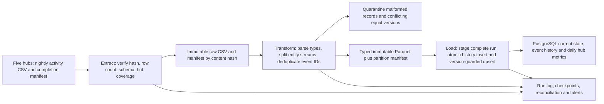

# Veridian Logistics — Nightly Activity ETL Design

**Design-only coursework exercise.** This document describes Veridian, the
assigned fictional five-hub company; it does not rename TrackFlow or change its
models. Kept in this existing company monorepo under the owner's explicit
single-repository instruction, overriding the assignment's new-repository
suggestion. No ETL code, schema migration, or real customer data is delivered.

Source: [Designing a Data Pipeline](https://github.com/4GeeksAcademy/ai-engineering-syllabus/blob/main/content/projects/designing-data-pipeline/README.md),
read completely 2026-10-07. Schema fields below are **proposed contracts**, not
claims about a CSV we have inspected; the brief supplies no actual file.

## 1. Purpose

Turn five hubs' nightly mixed activity CSV exports into one current shipment
state per globally identifiable shipment plus an immutable deduplicated event
history, so dispatch and delivery counts do not count each status update as a
new shipment. Outputs: `shipment_current`, `shipment_event_history`, reconciled
daily hub metrics, and per-run quality/execution records.

Vehicle updates and route changes are separate entity streams: they are not
silently interpreted as shipment events. Their state/history follow the same
versioned-key pattern when the client confirms their identifiers.

## 2. Questions for the client and provisional decisions

1. Is `shipment_id` globally unique, or only within a source/hub? Can a shipment
   move hubs? **Proposal:** stable `(source_system, shipment_id)` key, never hub
   as part of shipment identity; source must issue a globally stable identifier
   or a documented cross-hub mapping before production.
2. Does each change carry an immutable `event_id` and an increasing
   `source_version`? Does `updated_at` represent business occurrence or export
   time? **Proposal:** require per-entity source versions; UTC occurrence time
   is separate. File order and ingest time are not reliable versions.
3. Is each export a full snapshot or incremental? Are late corrections,
   cancellations/deletions and historical reissues possible? **Proposal:**
   incremental events with explicit tombstones; absence is never a delete.
4. When is each hub's file complete, and what timezone defines its business
   day? **Proposal:** UTC storage with declared hub timezone for daily reports;
   require manifest completion, expected five-hub coverage and source row count.
5. What freshness, retention and data-access obligations apply? **Proposal:**
   complete by 06:00 UTC after scheduled delivery, alert after 30 minutes late;
   confirm SLA and retention with operations before activation.

These are implementation prerequisites, not reasons to invent missing source
fields. If no stable version/id can be supplied, conflicting state changes are
quarantined for reconciliation; arrival order will not decide customer status.

## 3. Data Format Analysis

CSV is acceptable at today's source boundary: easy for operations to inspect,
universal export support and low adoption cost. It lacks types, nested data and
schema evolution; quoting, delimiters, nulls, timestamp zones and decimal
conventions must be explicit. Require UTF-8, header/version contract, RFC-style
quoted fields, declared null marker, ISO timestamps, row counts and SHA-256
manifest; parse streams/chunks rather than loading unbounded files in memory.

Keep original CSV bytes in access-controlled immutable raw storage with their
content hash. Normalize valid records to typed **Parquet** partitions by source
and occurrence date for replay and analytical scans: column pruning,
compression and preserved types outperform repeated CSV parsing at scale.
Parquet is not a write-per-event operational store; finish immutable files before
publishing manifests. JSON Lines is useful for heterogeneous event envelopes or
quarantine diagnostics, but is larger and slower to scan; do not convert to JSON
merely for fashion. PostgreSQL staging/current/history tables are the atomic
serving boundary; an object file alone cannot enforce uniqueness or transactions.
Cost: additional storage and format/tooling; benefit: reproducible, cheap replays
and a fast indexed current-state query without repeatedly scanning history.

## 4. Data Flow Diagram

Extraction only reads completed manifests and stores source bytes once per hash.
Transformation validates entity keys/types, standardizes UTC, retains occurrence
and source-update times, and quarantines invalid data with reason codes. Dedup
happens **before aggregation**. Load publishes all affected serving rows and
business-date aggregates in one transaction after reconciliation. The run log
tracks rejected counts too; a successful load is not proof of complete coverage.

## 5. Deduplication Strategy — updates are not duplicates

Proposed envelope: `source_system`, `entity_type`, `entity_id`, `event_id`,
`source_version`, `occurred_at`, `source_updated_at`, `hub_id`, `operation`,
`payload`, `schema_version`. Shipment payload includes `shipment_id` and status.
Require the client to map actual CSV headers to this proposed contract.

- Exact retransmission: unique `(source_system, event_id)` in immutable history.
  Same key and canonical payload hash is a no-op. Different payload at the same
  event key is a conflict, not a last-writer-wins update.
- Lifecycle update: a different event for the same entity is retained in
  history. `shipment_current` has unique `(source_system, shipment_id)`; update
  only if incoming `source_version > stored.source_version`. Late older events
  remain historical and cannot regress delivered status.
- Equal versions and equal payloads are idempotent; equal versions with different
  payloads are quarantined. Do not use a hash or file row number as a fabricated
  chronological tiebreaker. A corrected version must be issued upstream.
- If event IDs are unavailable, a documented canonical hash of immutable entity
  identity, source version and event payload is a fallback for **exact repeat**
  detection only. It does not infer update order or repair conflicting versions.
- Current shipment totals count distinct shipment keys, not history rows.
  Transition KPIs count confirmed distinct transition IDs. Recompute affected
  hub/date aggregates from deduplicated history, replacing prior values; do not
  increment metrics again on every replay.

Example: shipment S42 v1 in-transit then v2 delivered, with v2 repeated in the
next export, produces two history rows and one current delivered row. If v1
arrives late, current state stays v2. An equal-v2 different status is a flagged
conflict. A hub transfer changes the state attribute, not shipment identity.

## 6. Idempotency and Concrete Recovery Plan

`batch_key = source_system + export_manifest_id + content_hash`; each execution
gets a new `run_id`, linked to any prior failed attempt. A ledger prevents
simultaneous publication of the same batch. Claim through a transactional lock
or leased row with a fencing generation; stale workers cannot publish.

1. Record Running and immutable source manifest. Stage normalized rows under
   run ID. Large staging chunks can commit independently because staging is
   invisible to report queries; record their checksums/counts.
2. Validate staging totals and business keys. Reuse complete verified staged
   artifacts after failure; discard incomplete staging, never half-publish it.
3. In **one database transaction**, acquire an exclusive global serving-publication
   advisory transaction lock (the same key for every batch) **before** history
   inserts and aggregate reads. Then insert unseen history events with unique-key
   constraints, version-guard current-state upserts, replace affected daily
   aggregates, record publication metadata and mark the batch committed.
4. Commit the source checkpoint only in that same transaction. Cleanup and
   notifications happen afterward and are retry-safe.

The per-batch ledger prevents duplicate execution of one export; it is not
enough for different batches touching the same hub/day. The global publication
lock serializes those batches, and aggregates are recomputed from committed
history plus this transaction's inserts after acquiring the lock, not from a
stale pre-lock snapshot. A READ COMMITTED load transaction sees the previous
publisher's committed rows. Throughput cost is acceptable for five nightly
hubs; future parallelization requires stable partition locks acquired in sorted
order and covering both old/new partitions of every correction.

**Failure after 847 of 1,412 serving rows:** the uncommitted load transaction
rolls back all 847. Next run reuses verified staging and retries the entire
publication transaction. If the connection drops during COMMIT, query the batch
ledger before retrying; a committed batch is a success/no-op, not a second load.
If only staging was partial, resume verified chunks or regenerate staging from
the immutable raw file. Never advance a watermark because parsing finished.

Late updates/corrections identify every affected original hub/day and replace
its aggregates from current deduplicated history, retaining a revision/run link.
Deleting stale group rows matters when a correction moves the last shipment out
of a group. A completed batch can be intentionally reprocessed under a new
transformation version, with explicit lineage—not silently skipped forever.

## 7. Execution Log Specification

Each attempt is durable; statuses are `Running`, `Completed`, `Failed` or
`Skipped`. Metrics must distinguish staged/attempted counts from committed counts.

| Field | Type | Audit purpose |
| --- | --- | --- |
| run_id / retry_of_run_id | UUID / nullable UUID | Unique attempt and retry lineage |
| batch_key, source hashes | text / JSON | Exact source bytes; duplicate-batch detection |
| started_at / finished_at | UTC timestamptz / nullable | Runtime, stuck-run detection and SLA |
| status / phase | enum / text | Last durable checkpoint and terminal outcome |
| source_window, hubs_expected/received | UTC range / integer | Coverage, late/missing-file distinction |
| rows_extracted / valid / quarantined | integer counters | Reconcile input population and failures |
| exact_duplicates / conflicting_rows | integer counters | Separate safe repeats from source corruption |
| history_inserted / current_updated / ignored_older | integers | Explain each valid source record's outcome |
| rows_committed / output_partitions | integer / JSON | What actually became visible, not merely attempted |
| transform_version / schema_version | text | Reproducibility after rule or input changes |
| checkpoint_uri / checksum | text | Recover only from a verified artifact |
| error_code / sanitized_error | text / nullable text | Actionable diagnosis without leaking row payloads |
| supersedes_run_id / fencing_generation | UUID / integer | Correction lineage and concurrent-writer protection |

Do not put customer payloads, credentials or raw exception connection strings
in logs. Restrict raw/quarantine stores separately from operational run metadata.

## 8. Production Robustness and Acceptance Scenarios

- **Schema and quality gate:** reject a changed mandatory header or conflicting
  equal-version record; do not silently coerce it. Publish nothing for a broken
  critical partition; bounded noncritical quarantines require explicit policy.
- **Bounded retries:** retry connection/timeouts with exponential backoff and
  jitter; do not retry invalid data forever. Exhaustion leaves Failed and alerts
  the operator with run ID and safe reason.
- **Coverage and freshness:** validate all five expected manifests and reconcile
  source counts to valid+rejected+dedup dispositions. A missing hub is unknown,
  not zero volume. Alert on missed SLA or unusual duplicate/reject ratios.
- **Concurrency:** database uniqueness, batch lock/fencing and an exclusive global
  publication lock across different batches prevent scheduled
  and manual runs from double-publishing or stale-writer overwrites.
- **Recovery drills:** interrupt staging, mid-publication and lost-COMMIT-response
  runs. Replays yield identical business values with new audit metadata only.
- **Resource/security boundaries:** chunk extraction, parameterized SQL,
  least-privilege roles, no secrets in source or logs, retention/access policy.

Review cases: repeat identical file; replay with a new filename but identical
event IDs; old version after new; equal-version conflict; cross-hub transfer;
two distinct batches concurrently updating the same hub/day (final aggregate
contains both committed populations); missing hub file; corrupt manifest;
process death mid-load; successful COMMIT
with lost response. For each, expected behavior follows sections 5–7. These are
design acceptance scenarios, **not claims of executed implementation tests**.

## 9. Rubric Map and Submission

Purpose → §1; client questions → §2; format recommendation → §3; complete ETL
diagram → §4; updates-as-inserts dedup → §5; concrete failure recovery → §6;
≥5 typed/logged fields with rationale → §7; actionable robustness/tradeoffs → §8.
Only this design and repository-required progress documentation change; no
pipeline code is included. Commit title: `feat: add pipeline design document`.
The owner requires a PR to main in the existing repository. The assignment's
main-branch submission becomes available after reviewed merge; before that,
the PR is the review artifact, not a claim the document has landed.
