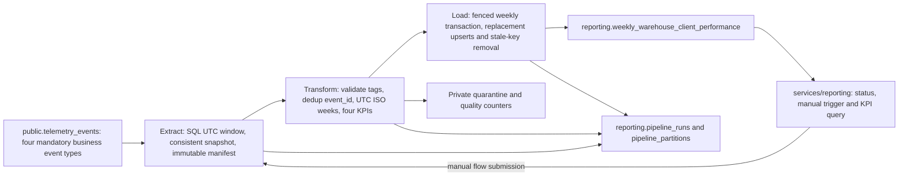

# TrackFlow — Weekly Warehouse & Client Performance Pipeline

Design phase only (Milestone 6, Part 1 of 3). No orchestration code, new table,
endpoint or schedule is deployed by this document.

Sources, read in full 2026-10-07:
- [Official design assignment](https://github.com/4GeeksAcademy/ai-engineering-syllabus/blob/main/content/projects/ai-eng-milestone-data-pipeline-design/README.md).
- [TrackFlow business-pipeline context](https://github.com/4GeeksAcademy/ai-engineering-syllabus/blob/main/content/contexts/06-telemetry-data-pipelines/data-pipelines/CONTEXT-trackflow.md).
- [TrackFlow telemetry context](https://github.com/4GeeksAcademy/ai-engineering-syllabus/blob/main/content/contexts/06-telemetry-data-pipelines/telemetry/CONTEXT-trackflow.md).
- Local `CONTEXT.md`, `docs/CONTEXT-inventory-trackflow.md`,
  `docs/telemetry/event-schemas.json`, `services/api/inventory_telemetry_config.py`.

## 1. Current State and Business Gap

The accepted capture milestone instruments 23 event types via the existing
backoffice and `POST /telemetry/events`. Storage PR #29 (`cfc11a6`) replaces the
stub with per-event validation, bulk append-only storage and correlation tags
in `public.telemetry_events`. It is reviewed and CI-green, **not yet merged**;
its required real Supabase screenshot still needs trusted login. Historical
verification found 34 rows of nine types; this design does not assert a fresh
live audit or complete business coverage from that historical sample.

The next report branch, `codex/telemetry-technical-report`, implements four
technical metrics in `services/telemetry/analysis.py`: events/day/type,
error-event share/day/service, latency/day/endpoint and login-failure share/day,
served by authenticated `GET /telemetry/report` with 60-second in-memory cache.
That implementation is in review, not accepted main. Its local SQL/Pandas tests
are not evidence of a live business report. This design can be reviewed from
main independently; implementation must consume the verified prerequisite
schema after its delivery gates clear.

Those technical metrics help engineering debug the system. They do not answer
Thomas's or Ana's weekly question: how much each client's warehouse received,
how many orders it dispatched, how often minimum-stock thresholds fired, and
how many discrepancies occurred relative to outbound orders. The new pipeline
produces this separate, auditable business rollup. It **never edits** the
technical analysis/report or writes its output to `telemetry_events`.

## 2. Purpose, Audience and Cadence

**Produce Thomas's and Ana's Monday-morning Weekly Warehouse & Client
Performance Report by computing Inbound Volume, Outbound Throughput, Stockout
Frequency and Discrepancy Rate from `inbound_order_created`,
`outbound_order_created`, `stock_threshold_triggered` and
`inventory_discrepancy_detected`, grouped by UTC ISO week, warehouse and client.**

Schedule proposal for implementation: Monday 05:00 UTC, with a 06:00 UTC
freshness target and alert if no successful publication by then. The completed
week is `[previous Monday 00:00 UTC, current Monday 00:00 UTC)`. This explicit
UTC contract matches CONTEXT; warehouse-local dates do not redefine buckets.
Default scheduled recomputation covers that completed week plus the previous
three completed weeks (28-day late-arrival lookback). Older late corrections
require explicit backfill. The exact operational alert target is a proposed
service target; weekly Monday freshness is the actual assignment requirement.
No schedule is activated in this design milestone.

## 3. Extraction Format, Types and Coverage

Source is the existing Supabase/PostgreSQL `public.telemetry_events` table:
`id` UUID, `timestamp` timestamptz, `service` text, `event_type` text, `level`
text, `value` numeric nullable, `message` text nullable, `tags` JSONB. New rows
arrive in frontend batches/on page exit; API-originated rejection events also
persist internally. Source timestamps mean event occurrence, not insertion.

Parameterized SQL selects **only** the four CONTEXT event types and the
requested half-open timestamp window, projecting `id`, `timestamp`,
`event_type`, `tags`. Do not load all historical telemetry or technical events.
Read in bounded chunks under a repeatable-read snapshot and write a private,
immutable run manifest/Parquet extract under `data/raw/` runtime storage (ignored,
not committed). Keep a SHA-256 checksum, record count and extraction SQL version.
JSONB arrives as Python mappings, dates as aware UTC timestamps; Parquet
preserves types for a repeatable load retry. PostgreSQL remains authoritative.
Small local test fixtures are synthetic and explicitly identified as such.

Required event dimensions: `tags.warehouse` (`los_angeles` or `zaragoza`),
`tags.client_id`, `tags.product_id`, `tags.product_category`, `tags.quantity`;
correlation is `tags.event_id` (the original envelope `eventId`) and
`tags.request_id`. **Table `id` is a storage UUID, not the logical dedup key.**
Existing client IDs are opaque registry values such as
`client_01JTF000000000000000000001` for PureStep Footwear, not display names or
the generic context response's illustrative `fashion-co`. Preserve source IDs;
never generate a client or collapse different clients within a row.

Validate these fields against the existing catalogue. Quantities are units,
not weights/currency; inbound requires positive integer quantities. Drop no
malformed row silently: quarantine its storage/event key plus safe reason.
Fail publication for affected weekly partitions if mandatory fields conflict
or source coverage is unknown. No recipient names, tracking strings, email or
auth tokens enter extracts/logs/outputs.

A read-only comparison with inventory order records and technical ingestion
health can diagnose missing capture, but does not replace business-event
inputs or secretly backfill them from unrelated records. The current browser
queue is not a guaranteed durable outbox. Absence of events alone cannot prove
zero business activity; publish an empty/zero population only after explicit
coverage checks and record that decision in run metadata.

## 4. Transformation and Exact Destination

Convert timestamps to UTC before computing ISO weeks; `week_start` is the UTC
Monday date, including ISO-year boundaries. Deduplicate logical events before
aggregation, then group **only** by `(warehouse, client_id, week_start)`.

| Field | Exact rule |
| --- | --- |
| inbound_units_count | Sum `tags.quantity` for distinct `inbound_order_created` events |
| outbound_orders_count | Count distinct `outbound_order_created` events, **not quantity** |
| stockout_events_count | Count distinct `stock_threshold_triggered` events |
| discrepancy_events_count | Count distinct `inventory_discrepancy_detected` events |
| discrepancy_rate | `discrepancy_events_count / outbound_orders_count`; **0 if denominator is 0** |

Generate rows for every warehouse/client/week with at least one relevant valid
event, filling absent event categories with zero. Do not invent rows for every
possible client/warehouse combination without a coverage/assignment source.

The context calls discrepancy rate a share of orders, but prescribes event
counts and the existing discrepancy event is a physical-count audit, not a
linked outbound order. Follow its exact formula: do not invent order joins,
clamp at 1 or reinterpret quantities. Values greater than 1 or discrepancy
activity with zero orders are review flags in run quality metadata; raw counts
remain visible. Example: 2 discrepancies / 3 outbound events = 2/3, not the
rounded illustration from CONTEXT. Preserve numeric precision, round only in
presentation. No country/currency dimension is added.

Exact proposed DDL from the company context (design, not a migration):

```sql
create table reporting.weekly_warehouse_client_performance (
  id uuid primary key default gen_random_uuid(),
  warehouse text not null,
  client_id text not null,
  week_start date not null,
  inbound_units_count integer not null default 0,
  outbound_orders_count integer not null default 0,
  stockout_events_count integer not null default 0,
  discrepancy_events_count integer not null default 0,
  discrepancy_rate numeric not null default 0,
  computed_at timestamptz not null default now(),
  unique (warehouse, client_id, week_start)
);
```

Operational metadata lives separately in planned `reporting.pipeline_runs`
and `reporting.pipeline_partitions` (publication/coverage/run lineage). The
required business table stays exactly as above. Inputs outside PostgreSQL
integer range fail quality validation before load; do not silently overflow.

## 5. Data Flow



Dependencies point from `services/reporting/` into `data/pipelines/`.
Reusable pure transformations belong to `data/process/`; flows/control/read
functions belong to `data/pipelines/`. Pipeline code must not import HTTP
routers or make an API round trip to call itself.

## 6. Source Duplicates, Updates and Late Events

**Existing append-only source:** two storage rows may represent a transmission
retry with identical `tags.event_id`; ingestion generates new table UUIDs and
has no unique constraint on that tag. Do not falsely claim storage upserts by
eventId. Deduplicate at extraction/transform by logical event ID globally within
the selected population. Same event ID/type/timestamp/business payload is one
event; different payload under the same ID is a conflict requiring quarantine
and a failed affected partition, not arbitrary last-writer-wins. Keep all source
UUIDs in private lineage for audit. Missing event IDs are not replaceable by
storage UUID without overstating counts.

Dedup before weekly/client grouping prevents duplicate counts when dimensions
conflict. Query targeted cross-window occurrences of selected event IDs to detect
conflicting timestamps moved outside the extraction window; fail on conflicts
rather than allowing the same action to appear in two weeks. This additional
query is bounded to extracted keys, not an all-history load.

**If a future source updates rows:** require a stable source primary key and
`updated_at`/monotonic version or CDC change stream, including tombstones. Store
version checkpoints and before/after affected grain keys in the control tables;
merge the newest authoritative version and recompute both old and new weekly
partitions when a timestamp/client/warehouse changes. Equal versions with
conflicting payloads fail. Do not invent `updated_at` in today's eight-column
source or use its occurrence timestamp as an insertion watermark. For existing
append-only telemetry, full-window recomputation avoids that false watermark.

**Future ingestion idempotency contract (design only, separate change):** to
prevent new duplicate source rows rather than only duplicate reporting counts,
propose a durable intake ledger with a unique original `eventId`, canonical
payload digest and confirmed storage-row ID. Claim that key and append the
telemetry row in the **same transaction**. Same-ID/same-payload retry returns
HTTP 200 with an explicit `already_stored` acknowledgment; a new committed
item returns `stored`. Same ID with a different payload returns a permanent
409 conflict and must not overwrite an immutable event. A timeout/lost reply
means **unconfirmed**, so retry with the identical eventId and payload;
transient unavailable storage returns 503 (or 429 with Retry-After for capacity)
and bounded backoff. Schema-validation failures are permanent, not retried.
For batches, a versioned response would distinguish stored/already-stored/
rejected outcomes per item; adding that contract requires separately approved
capture/storage/client compatibility work. It is **not today's 2/1/1 receipt**
and is not implemented, migrated or silently relied on here. Historical duplicate
rows remain immutable; pipeline dedup remains mandatory. Existing source row
counts may exceed distinct-action counts until that future contract is deployed.

**Late events:** re-extract and replace complete affected weekly partitions from
source under a new run snapshot. Scheduled 28-day lookback bounds the cost and
correction horizon; explicit requested backfill handles older arrivals. Log the
prior and superseding publication run for each week. A partial window is never
published under the name of a complete ISO week.

## 7. Idempotency, Atomic Load and Recovery

Unique business key is `(warehouse, client_id, week_start)`. Load the **absolute
recomputed values**, using `ON CONFLICT ... DO UPDATE`; never add this run's
counts to stored counts. Preserve existing row IDs on updates. Set computed_at
for the new publication; identical business values are idempotent even though
run metadata/freshness timestamps change.

Take one database advisory lock for this pipeline's publication scope before
reading the run snapshot, held for the run lifetime (or use a leased run row
with fencing token checked inside publication). This prevents a slow older
extract from publishing after a newer one. Manual/scheduled overlap returns
existing run status rather than racing. On connection loss, abandon the old
worker; it must reacquire and refresh its snapshot or verify an unchanged source
manifest before publication, never continue with a lost lock.

Stage extracted/transformed artifacts by run ID, verify checksums and complete
row counts, then load the **entire selected window in one transaction**:

1. Upsert all recomputed rows into the exact reporting destination.
2. Remove keys previously published in those weeks that are absent from the
   fully validated replacement (not from source telemetry). This is necessary
   for corrections that move/remove the final event in a group.
3. Update partition coverage/publication metadata and mark run Completed with
   committed row counts in that same transaction.

If the pipeline loads 847 of 1,412 rows then fails, the uncommitted transaction
rolls back all output changes. A rerun obtains the lock, uses the same verified
snapshot if policy permits or a fresh full extraction, and publishes absolute
values once. If COMMIT succeeds but the network reply is lost, reconcile the
run/partition records first: Completed means no duplicate publication is needed.
Staging progress is never confused with successful destination publication.
Failed status is written in a separate safe transaction after rollback, with
retry-of lineage. Old published data remains readable and visibly stale.

Quality failure publishes nothing; stale source/failure status must be visible
to consumers. Retries use bounded exponential backoff for transient database
errors only. Validation or unknown-client failures need correction, not endless
retries. An interrupted Running run with an expired heartbeat is marked Failed
only after confirming its lease/lock is gone.

## 8. Execution Log (planned reporting.pipeline_runs)

| Field | Type | Why it is required |
| --- | --- | --- |
| run_id, retry_of_run_id | UUID, nullable UUID | Unique attempt and recovery chain |
| started_at, finished_at, heartbeat_at | timestamptz, nullable timestamptz, timestamptz | Duration, missed schedule and abandoned-run detection |
| window_start, window_end | UTC timestamptz | Exact exclusive-end coverage; no drifting intervals |
| status, phase | enum, text | Running/Completed/Failed and last durable stage |
| trigger, prefect_flow_run_id | text, UUID | Scheduled/manual/backfill and orchestration trace |
| rows_extracted, deduplicated, rejected | bigint counts | Explain disposition of every source row |
| rows_transformed, rows_committed, stale_keys_removed | bigint counts | Separate work attempted from published output |
| source_manifest_uri, checksum, snapshot_at | text, text, timestamptz | Reproducible extraction and safe checkpoint |
| code_version, schema_version | text, text | Reproduce calculations after code changes |
| coverage_state, quality_summary | enum, JSONB | Distinguish no activity from missing collection |
| error_code, error_summary | text, nullable text | Safe actionable failure reason, no credentials/payloads |
| lock_generation, supersedes_run_ids | bigint, UUID array | Concurrent-writer protection and revision lineage |

Private manifest maps source storage IDs and event IDs to run ID and output
keys. Retain request_id only within restricted trace storage, not business
reports. Redact secrets in Prefect and SQL errors; pipeline credentials are not
run parameters. Counts reconcile extracted = accepted + duplicate + rejected
under disjoint dispositions; business totals are checked separately.

## 9. Prefect Mapping and Configuration

Main flow: `weekly_warehouse_client_performance_flow(window_start, window_end)`
in `data/pipelines/pipeline.py`. At least these tasks:

1. `extract_business_events` — SQL scope, snapshot/manifest/checkpoint; transient
   database retry at most 3 attempts, exponential backoff/jitter.
2. `transform_weekly_performance` — import pure functions from `data/process/`,
   validate, dedup, aggregate exact KPIs; deterministic, no database writes.
3. `load_weekly_performance` — atomic replacement/upsert and run completion;
   reconcile uncertain COMMIT before retrying.
4. `record_run_failure` / quality/checkpoint helpers — safe recovery metadata.

Relevant Prefect states: Running while a task/flow executes; Completed only
after durable publication; Failed after validation or exhausted retry. Retrying
is not Completed. No second flow is required for this phase; later Part 3 will
split stages into subflows while preserving the business contract. Script-based
execution of `python data/pipelines/pipeline.py` is planned for implementation.

Prefect blocks: a secret source connection (read-only telemetry privileges), a
separate reporting-writer connection constrained to `reporting`, private raw
storage location/credentials, schedule/timezone and late-lookback configuration.
Use environment/Prefect secret blocks injected at runtime; never store a live
DSN in Markdown, a source file, flow parameter output or Git. No credentials are
requested in chat, and no blocks are created during design.

## 10. Planned Application Endpoints (services/reporting)

| Endpoint | Calls into data/pipelines | Contract |
| --- | --- | --- |
| `GET /reporting/pipeline-runs/latest` | `queries.get_latest_run()` | Latest durable run/status/window/quality/freshness metadata; null/no-runs explicitly if never run |
| `POST /reporting/pipeline-runs` | `runner.submit_weekly_performance_run()` which launches `weekly_warehouse_client_performance_flow` | Validates optional completed ISO-week window; 202 with durable run_id/status URL; active overlap returns existing run metadata without a second writer |
| `GET /reporting/weekly-warehouse-client-performance` | `queries.get_weekly_performance(week_start)` | Optional Monday date; defaults to latest **successfully published** week, not the current calendar week; returns all warehouse/client entries and explicit freshness metadata |

A tiny read-only adapter in `data/pipelines/queries.py` reads reporting tables;
no metrics are recomputed in HTTP handlers. Requests use existing internal
backoffice authentication; manual trigger requires an explicitly authorized
operations role/policy (not simply any external account). Authorization policy
must be implemented/reviewed before exposing manual runs. Keep tenant-scoped
APIs isolated; Thomas/Ana's cross-client report is only for authorized TrackFlow
internal operations. Inputs are validated/parameterized. No public report.
If no week is published, return an explicit empty/not-ready result, never
fabricated KPI rows. Prior completed data remains queryable after a later failure.

## 11. Ten Failure/Design Questions Answered

1. **Source duplicate:** current pipeline dedup on `tags.event_id`; proposed
   atomic eventId-unique intake ledger prevents new source duplicates (§6),
   separately approved and not assumed deployed.
2. **Rerun after partial load:** rollback and absolute replacement transaction (§7).
3. **Late event:** repeat completed-week partitions, revision metadata; old events
   beyond lookback need explicit backfill (§6).
4. **Silence vs zero:** capture coverage, ingestion health, source/domain count
   reconciliation, heartbeat and last successful publication; unknown ≠ 0 (§3,8).
5. **Trace event to report:** manifest event/storage IDs → run ID → grain; request
   correlation stays private; window/snapshot checks expose drift/bursts (§8).
6. **Growth vs data loss:** compare relevant events with order activity and active
   warehouse capture, rejection/duplicate ratios and comparable prior weeks;
   a change in raw volume alone is not a business conclusion (§3,8).
7. **Database outage:** bounded retry and manifest/checkpoint; no partial visible
   output, COMMIT uncertainty reconciled via run record (§7,9).
8. **Frontend buffer:** current in-memory batching is not durable offline capture.
   A future bounded encrypted/expiring buffer requires explicit privacy design;
   preserve event IDs, handle backpressure and late windows. Not implemented here.
9. **Transmission retry:** preserve eventId; existing receipt 2/1/1 describes valid
   storage rows, not dedup status. A timeout may append a duplicate; downstream
   dedup handles it. Do not invent an ingestion upsert/"already stored" response
   or rewrite the storage contract during this design milestone. The explicitly
   proposed future contract distinguishes 200 stored/already_stored, 409
   conflict, 503/429 retry and uncertain timeout while preserving eventId (§6).
10. **Concurrent runs:** one scope lock/fencing before snapshot, explicit overlap
    response and lost-lease recovery; no old-worker publication (§7,10).

## 12. Acceptance Examples and Rubric Map

Synthetic design example only: same client/week/warehouse has inbound quantities
5 and 7, three outbound events with quantities 1, 9 and 2, one threshold event
and two discrepancy events. Expect `(12, 3, 1, 2, 2/3)`; repeating any identical
event ID changes nothing. Another client or warehouse gets another row. A week
with discrepancies but no outbound has rate 0 by CONTEXT, with a quality flag.
Sunday 23:59:59Z and Monday 00:00Z fall in different ISO weeks; Dec/Jan ISO-year
boundaries are covered. Conflicting duplicate IDs fail instead of inflating data.
These are proposed implementation tests, not claims of executed pipeline code.

Current state/gap → §1; concrete purpose/context KPIs → §2,4; extraction and
cadence → §3; exact destination and independent technical path → §1,4,10;
three-stage diagram → §5; updates/dedup/late data → §6; second-run failure
recovery → §7; ≥5 typed audit fields → §8; main flow/≥3 tasks/blocks/states → §9;
three endpoints and imported pipeline functions → §10; all ten prompts → §11.
No orchestration code, API behavior, source schema or technical report changed.
